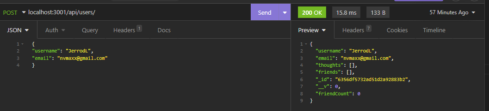
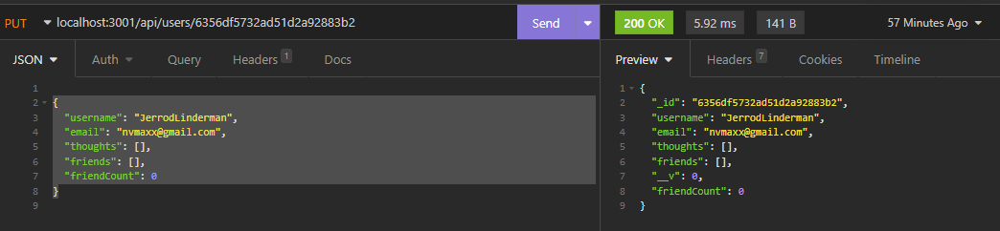
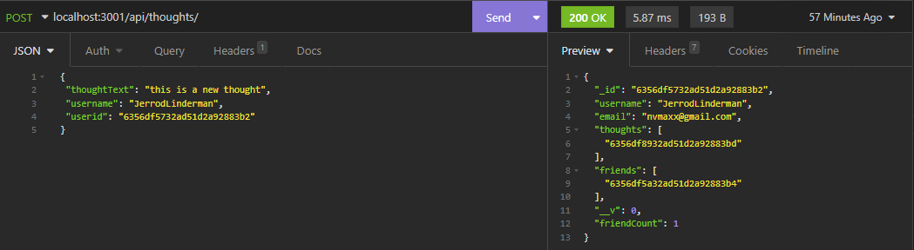
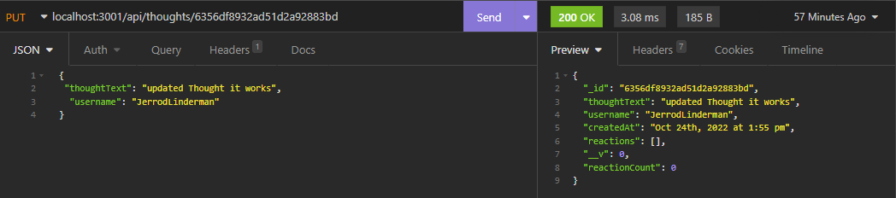
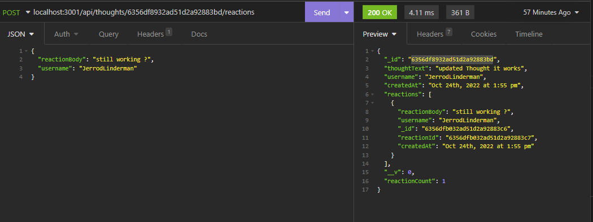

  <div id="header" align="center">
  
  </div>
  <div align="center">
  
  ## Jerrod Linderman

  </div>
  <div align="center">
  
  </div>
  
  
  <h1 align="center">Badges</h1>
  <div align="center">
  <div align="center" style="display:block; width:300px; >
  
  [](https://badges.greenkeeper.io/Node.js)[](https://badges.greenkeeper.io/NPM)[](https://badges.greenkeeper.io/Express.js)[](https://badges.greenkeeper.io/JavaScript)[](https://badges.greenkeeper.io/Markdown)[](https://badges.greenkeeper.io/MongoDB)[](https://badges.greenkeeper.io/Insomnia)

  [](https://opensource.org/licenses/MIT)
  
  
  </div>
  </div>
  
  <h1 align="center">
  
  SocialNetwork-Linderman</h1>

  https://drive.google.com/file/d/1DhZU65kcEKPKe5ZiXsa5MUJha1O9st8f/view?usp=sharing
  
  
  ## Table of Contents:
  1. [Description](#description)
  2. [Technology](#technology)
  3. [Installation](#Installation)
  4. [Usage](#usage)
  5. [How To Contribute](#contribute)
  6. [license](#license)
  7. [Tests](#tests)
  8. [Github](#github)
  9. [Email](#questions)

  ## Description
  An API for a social network web application users can share their thoughts and reactions to friends thoughts and create friends.


  ## Technology

  Created with:

  * Node.js
  * Express.js
  * MongoDB
  * Mongoose
  * JavaScript
  * Insomnia - API testing

  ## Installation

  To install necessary dependencies, run the following commands:

  ```npm init -y```

  ```npm install```

  ```npm express```

  ```npm mongoose```
  


  ## Usage
  Start it up using node server or nodemon server, then use insomnia to create users: api calls are described below.

  To create a user using insomnia, use the following api call:

  ```POST /api/users```

  example of a user:

  ```
  {
  "username": "JerrodL",
  "email": "nvmaxx@gmail.com"
  } 
  ```

  

   To get all users using insomnia, use the following api call:

  ```GET /api/users```

   To get user by id using insomnia, use the following api call:

  ```GET /api/users/:id```

   To update user by id using insomnia, use the following api call:

  ```PUT /api/users/:id```

  Example of a user update using the guid of the user: "_id": "6356df5732ad51d2a92883b2"


  ```
  {
  "username": "JerrodLinderman",
  "email": nvmaxx@gmail.com"
  "thoughts": [],
  "friends": [],
  "friendCount": 0
  }
  ```

  

   To delete user by id using insomnia, use the following api call:

  ```DELETE /api/users/:id```


  create a friend using insomnia, use the following api call:

  ```POST /api/users/:userId/friends/:friendId```


  Delete a friend using insomnia, use the following api call:

  ```DELETE /api/users/:userId/friends/:friendId```

  To create a thought using insomnia, use the following api call:

  ```POST /api/thoughts```

  example of a thought:

  ```
  {
  "thoughtText": "This is a new thought",
  "username": "JerrodLinderman",
  "userId": "6356df5732ad51d2a92883b2"
  }
  ```
  

  To get all thoughts using insomnia, use the following api call:

  ```GET /api/thoughts```
  
  To get thought by id using insomnia, use the following api call:

  ```GET /api/thoughts/:id```


  To update thought by id using insomnia, use the following api call:

  ```PUT /api/thoughts/:id```

  Example of a thought update using the guid of the thought: "_id": "6356df5732ad51d2a92883b2"




  To delete thought by id using insomnia, use the following api call:

  ```DELETE /api/thoughts/:id```

  To create a reaction using insomnia, use the following api call:

  ```POST /api/thoughts/:thoughtId/reactions```

  example of a reaction:

  ```
  {
  "reactionBody": "still working ?",
  "username": "JerrodLinderman"
  }
  ```
  

  To delete a reaction using insomnia, use the following api call:

  ```DELETE /api/thoughts/:thoughtId/reactions/:reactionId```


  
 
  ## Contribute
  
  [Contributor Covenant](https://www.contributor-covenant.org/)

  At this time owner is not accepting any contributions to this project.


  ## License

  Published under the [MIT](license.txt) License.
  

  Read More about the licence by clicking this Link: [MIT](https://opensource.org/licenses/MIT).
 

  ## Tests
  Using API calls from insomnia.


  ## GitHub
  [nvmax](https://github.com/nvmax)

  ## Questions
  If you have any questions, please contact me by clicking the email link below:
  ### [nvmaxx@gmail.com](nvmaxx@gmail.com) 

 
